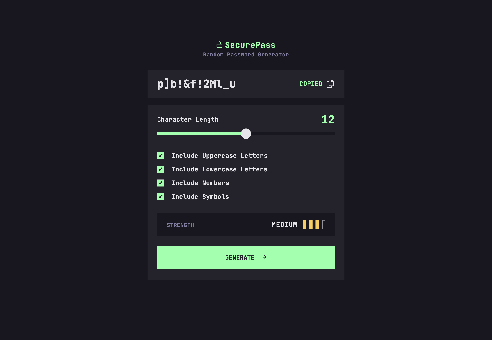
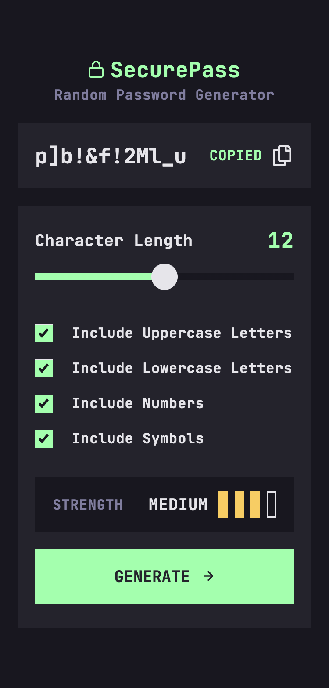

# Frontend Mentor - Password generator app solution

This is a solution to the [Password generator app challenge on Frontend Mentor](https://www.frontendmentor.io/challenges/password-generator-app-Mr8CLycqjh). Frontend Mentor challenges help you improve your coding skills by building realistic projects.

## Table of contents

- [Overview](#overview)
  - [The challenge](#the-challenge)
  - [Screenshots](#screenshot)
  - [Links](#links)
- [My process](#my-process)
  - [Built with](#built-with)
  - [What I learned](#what-i-learned)
  - [Continued development](#continued-development)
  - [Useful resources](#useful-resources)
- [Author](#author)

## Overview

### The challenge

Users should be able to:

- Generate a password based on the selected inclusion options
- Copy the generated password to the computer's clipboard
- See a strength rating for their generated password
- View the optimal layout for the interface depending on their device's screen size
- See hover and focus states for all interactive elements on the page

### Screenshots

#### Desktop

#### Mobile

### Links

- Solution URL: [https://github.com/bnielsencodes/SecurePass](https://github.com/bnielsencodes/SecurePass)
- Live Site URL: [https://bnielsen.dev/SecurePass] (https://bnielsen.dev/SecurePass)

## My process

### Built with

- HTML5 markup
- Tailwind CSS
- CSS custom properties
- Vanilla JavaScript
- Mobile-first workflow

### What I learned

This project really challenged my Javascript knowledge. Luckily I was able to find the resources linked below that helped me further understand some of the things I was struggling with.

### Continued development

I really wanted to use React with this project, but am not comfortable enough with it yet so I stuck to HTML, Tailwind CSS, and vanilla JavaScript. I plan on continuing to improve my React skills and knowledge so I can feel more confident to use it on future projects.

### Useful resources

- [How to Make a Password Strength Checker](https://youtu.be/2_4tEdyNfO0) - This YouTube video by CodingLab helped me understand some of the javascript functionality behind checking the strength of a generated password.
- [Building a Password Generator with JavaScript](https://www.studytonight.com/post/building-a-password-generator-with-javascript) - This is a great article which helped me understand some of the JavaScript functionality behind generating a random password. I'd recommend it to anyone still learning this concept.

## Author

- Website - [Brandon Nielsen](https://www.bnielsen.dev)
- Frontend Mentor - [@bnielsencodes](https://www.frontendmentor.io/profile/bnielsencodes)
- Twitter - [@bnielsencodes](https://twitter.com/bnielsencodes)
